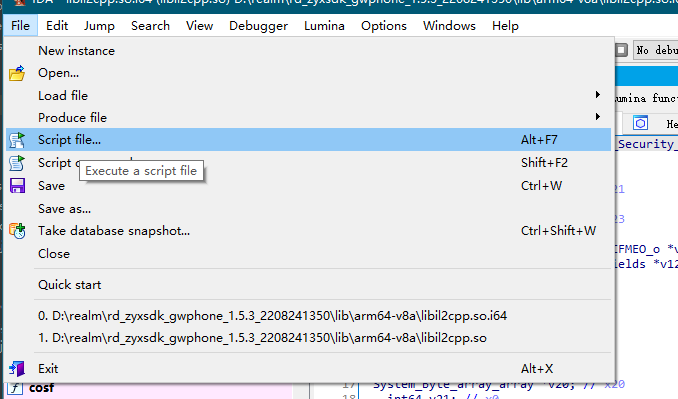
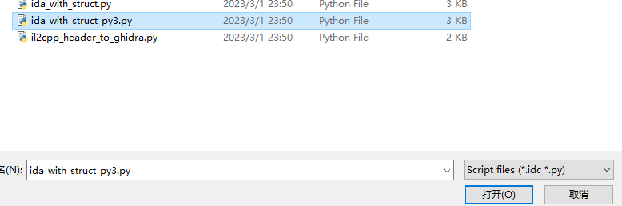
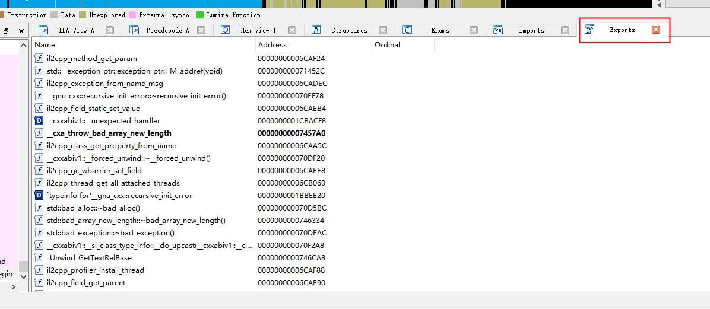
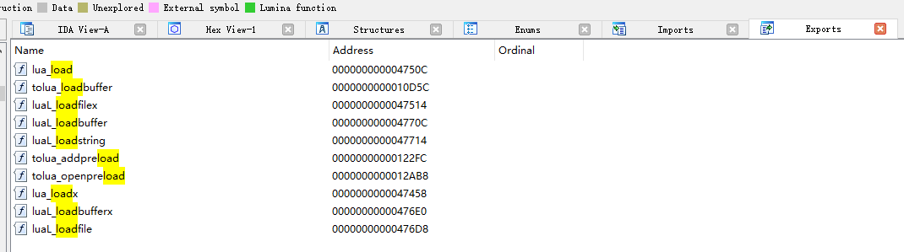

# unity-I2cpp逆向
对于I2cpp的逆向，主要步骤如下：
1. 获取libil2cpp.so文件（未加密的可以从apk中提取，加密的可以从内存中dump）
2. 获取metadata文件（从apk中提取，部分apk有加密，代码中可以找到解密方法）
3. 使用[Il2cppdumper](https://github.com/Perfare/Il2CppDumper)还原DLL文件、dump.cs、方法名和常量等等
4. 使用[dnSpy](https://github.com/dnSpy/dnSpy)反编译DLL文件，分析关键类和方法（基本上这里都只能看到方法名和类定义）
5. 使用IDA分析libil2cpp.so，分析关键函数和逻辑，借助上上一步导入到IDA中，详见[ida_with_structpy](https://github.com/Perfare/Il2CppDumper/blob/master/README.zh-CN.md#ida_with_structpy)
6. 分析游戏内是否有lua脚本，如果有，可以使用frida dump lua脚本，分析关键逻辑
7. dump出lua脚本，如果有加密，可以使用`unluac.jar`尝试解密
8. 使用frida hook lua脚本，修改游戏逻辑，或者你想做的任何事情

## 1. 获取libil2cpp.so文件
apk文件本身就是一个zip文件，可以直接解压，然后在`lib\armeabi-v7a`或者`lib\arm64-v8a`目录下找到`libil2cpp.so`文件。如果更改成`.zip`文件后无法解压，那么通过010Editor打开，看文件头的部分是否是`PK`如果不是则改成`PK`。

如果是加密的，可以先尝试在内存中dump，若果还是加密的，则需要找到解密方法，这个暂时不做讨论。
如果遇到可以试试[Zygisk-Il2CppDumper](https://github.com/Perfare/Zygisk-Il2CppDumper/blob/master/README.zh-CN.md)工具

游戏厂商为了防止反编译，会对编译出来的apk包修改一些指定标识位，导致无法正常解压或反编译这个时候拿正常的apk对应把标识位进行修改即可。最常见的标识位修改是`zip`标识头。

## 2. 获取metadata文件
metadata文件是一个二进制文件，在解压后的apk目录下，可以找到`assets\bin\Data\Managed\Metadata`目录，里面有一个`global-metadata.dat`文件，这个就是metadata文件。
如果没有或者文件是加密的可以使用[frida-il2cppDumper](https://github.com/IIIImmmyyy/frida-il2cppDumper)从内存中dump出来。

## 3. 使用Il2cppdumper还原DLL文件
下载[Il2CppDumper-win](https://github.com/Perfare/Il2CppDumper/releases)，双击打开，先选择`libil2cpp.so`、再选择`global-metadata.dat`文件，等待完成。
完成后会生成`dump.cs`、`DummyDll`、`script.json`、`stringliteral.json`、`il2cpp.h`等文件。
DummyDll内是还原出来的DLL文件，可以使用dnSpy打开，但是只能看到方法名和类定义，不能看到方法体。
在`IDA`中可以使用`ida_with_struct_py3.py`脚本导入，可以让`IDA`的伪代码有结构定义。

## 4. 使用dnSpy反编译DLL文件
下载[dnSpy](https://github.com/dnSpy/dnSpy/releases)
使用dnSpy打开`DummyDll`文件夹，可以看到方法名和类定义，一般游戏内的自定义空间都会在`Assembly-CSharp.dll`中，可以关注这个DLL文件。

## 5. 使用IDA分析libil2cpp.so
+ 将`libil2cpp.so`文件拖入IDA中，等待分析完成（左下角地址码不跳）。
+ 将上面步骤生成的定义加载到IDA中，`File->Script file`，选择`ida_with_struct_py3.py`脚本。


+ 之后依次选择`script.json`、`il2cpp.h`文件，等待加载完成。
+ 可以看到IDA中的伪代码有结构定义了。
+ 打开`dump.cs`根据`Offset: 0x000`地址在ida中找到对应的函数，分析逻辑。
+ 补充一些IDA常用快捷键，
  + x 为搜索引用，
  + g 跳转到地址，
  + n 重命名，
  + / 添加备注，
  + tab 切换视图，
  + space 切换hex和汇编视图。

## 6. 分析游戏内是否有lua脚本
首先我们进入解压的apk内，在lib文件夹下，寻找关键词`lua`，例如`libluajit.so`、`libtolua.so`、`libxlua.so`如果看到这些so则大致可以判断游戏内存在`lua`脚本。
游戏厂商为了游戏能实现热更新效果，不用每次更新版本都需要重新安装apk，都会将一部分逻辑放在lua脚本。
找到so后，我们需要将so拖到IDA中进行分析，我们直接看导出表。


可以看到有`luaL_loadbuffer`、`luaL_loadbufferx`、`luaL_loadfile`、`luaL_loadstring`等函数，这些函数都是lua脚本加载函数，这些函数都非常关键下面会提到。
## 7. dump出lua脚本
分析该so文件，根据分析所有的lua文件加载都会经过`luaL_loadbufferx`函数，所以我们只需要hook这个函数，就可以dump出所有的lua脚本。
这里我们自己编写脚本来实现hook，大体步骤如下：
1. 在游戏打开时立即hook
2. 在导出表内找到`luaL_loadbufferx`函数的地址。
3. 通过观察`luaL_loadbufferx`函数的参数，arg 0是lua env, arg 1是脚本content; arg 2是脚本size; arg 3脚本名称name
4. hook该函数，在`onEnter`时发送加载的lua文件到`py`。
5. 将接收到的lua脚本，写入到指定目录内。

编写该脚本如下：
```python
# dump_lua.py
import os
import time
import frida
import sys

jscode = """
    console.log('start hook')
    var addr = Module.findExportByName('libtolua.so', 'luaL_loadbufferx');
    while(addr == null) {
        addr = Module.findExportByName('libtolua.so', 'luaL_loadbufferx');
    }

    console.log('addr', addr)
    Interceptor.attach(addr, {
        onEnter: function(args) {
           var name = Memory.readUtf8String(args[3]);
           var obj = {};
           obj.size = args[2].toInt32()
           obj.name = name;
           obj.content = Memory.readByteArray(args[1], obj.size)
           send(String(name), obj.content)
       }
    })
"""

def write(path, content):
    print('writh', path)
    folder = os.path.dirname(path)
    if not os.path.exists(folder):
        os.makedirs(folder)
    open(path, 'wb').write(content)

def on_message(message, data):
    name = message['payload']
    content = data
    write("lua_script/"+name+'.lua', content)

if __name__ == "__main__":
    device = frida.get_remote_device()
    pid = device.spawn(["your game package name"])
    session = device.attach(pid)
    device.resume(pid)
    time.sleep(1)
    script = session.create_script(jscode)

    script.on("message", on_message)
    script.load()
    sys.stdin.read()
```
运行该脚本
```shell
python dump_lua.py
```
打开游戏，可以看到lua脚本被dump到`lua_script`文件夹内，多点击游戏内的各个环节，尽量将游戏内的`lua`脚本都下载下来。

## 8. 使用frida hook lua脚本
在上面我们dump出了lua脚本，但是我们还需要分析lua脚本的逻辑，比如我们分析出来一个lua脚本是我们需要替换更改的，我们可以使用hook将此脚本替换为我们更改过的lua脚本。
实现思路是：hook`luaL_loadbufferx`函数，当加载脚本时如果脚本在本地文件夹内存在，则读取本地文件夹内的脚本，否则加载原始脚本。
实现代码如下:
```javascript
// lua_dump.js
function dump(filePath, data, dataLen) {
  const dumpfile = new File(filePath, 'wb');
  dumpfile.write(data.readByteArray(dataLen));
  dumpfile.close();
  console.log('unity_dump_lua', { 'filePath': filePath });
}

function access(filePath) {
  const ptr_access = Module.findExportByName('libc.so', 'access');
  const func_access = new NativeFunction(ptr_access, 'int', ['pointer', 'int']);
  const ptr_filepath = Memory.allocUtf8String(filePath);
  return func_access(ptr_filepath, 0);
}

function mkdir(Path) {
  const ptr_mkdir = Module.findExportByName(null, 'mkdir');
  const func_mkdir = new NativeFunction(ptr_mkdir, 'int', ['pointer', 'int']);
  const ptr_filepath = Memory.allocUtf8String(Path);
  return func_mkdir(ptr_filepath, 755);
}

function folder_mkdirs(p, app_path) {
  const p_list = p.split('/');
  let pp = app_path;
  for (let i = 0; i < p_list.length; i++) {
    pp = pp + '/' + p_list[i];
    if (access(pp) !== 0) {
      mkdir(pp);
    }
  }
}

function readFile(filePath) {
  const ptr_open = Module.findExportByName('libc.so', 'open');
  const open = new NativeFunction(ptr_open, 'int', ['pointer', 'int']);
  const ptr_read = Module.findExportByName('libc.so', 'read');
  const read = new NativeFunction(ptr_read, 'int', ['int', 'pointer', 'int']);
  const ptr_close = Module.findExportByName('libc.so', 'close');
  const close = new NativeFunction(ptr_close, 'int', ['int']);
  const fd = open(Memory.allocUtf8String(filePath), 0);
  const size = get_file_size(fd);
  if (size > 0) {
    const data = Memory.alloc(size + 5);
    if (read(fd, data, size) < 0) {
      console.log('[+] Unable to read DLL [!] ' + filePath);
      close(fd);
      return { data: null, size: 0 };
    }
    close(fd);
    return { data: data, size: size };
  } else {
    return { data: null, size: 0 };
  }
}

function get_file_size(fd) {
  const statBuff = Memory.alloc(500);
  const fstatSymbol = Module.findExportByName('libc.so', 'fstat');
  const fstat = new NativeFunction(fstatSymbol, 'int', ['int', 'pointer']);
  if (fd > 0) {
    const ret = fstat(fd, statBuff);
    if (ret < 0) {
      console.log('[+] fstat --> failed [!]');
    }
  }
  return Memory.readS32(statBuff.add(0x30));
}

function dump_lua(package_name, addr) {
  const app_path = `/data/data/${package_name}/luadump/`;
  Interceptor.attach(addr, {
    onEnter: function (args) {
      // args[1] content; args[2] size; args[3] name
      const name = Memory.readCString(args[3]);
      if (name.length < 50 && name.length > 0) {
        const path = name.substring(0, name.lastIndexOf('/'));
        if (access(app_path + path) === -1) {
          folder_mkdirs(path, app_path);
        }
        if (access(app_path + name) === 0) {
          if (name !== 'chunk' && name !== 'Init') {
            const data = readFile(app_path + name);
            if (data.data == null) {
              console.log('error', 'open ' + app_path + name + ' failed !');
              return;
            }
            args[2] = new NativePointer(ptr(data.size));
            args[1].writeByteArray(data.data.readByteArray(data.size));
            console.log('load lua file :' + app_path + name);
          }
        } else {
          dump(app_path + name, args[1], args[2].toInt32());
          console.log('dump :' + app_path + name);
        }
      }
    }
  });
}

var addr = Module.findExportByName('libtolua.so', 'luaL_loadbufferx');
while (addr == null) {
  addr = Module.findExportByName('libtolua.so', 'luaL_loadbufferx');
}

console.log('start hook');
console.log('addr', addr);
dump_lua('your package name', addr);
```

这里我们将`/data/data/${package_name}/luadump/`作为我们的脚本存放目录，在第一次运行的时候我们把加载的lua脚本dump到这个目录下，然后我们可以修改这个目录下的lua脚本，再次执行脚本，这时候我们的lua脚本就会被替换为我们修改过的lua脚本。
```shell
# 执行脚本
frida -U -f your package name -l lua_dump.js --pause
```

## 9. 其他
- 使用[jadx-gui](https://github.com/skylot/jadx/releases)反编译apk文件，查看游戏逻辑
- 使用[AssetBundleExtractor](https://github.com/SeriousCache/UABE/releases)分析unity游戏的静态资源文件，或者更改。
