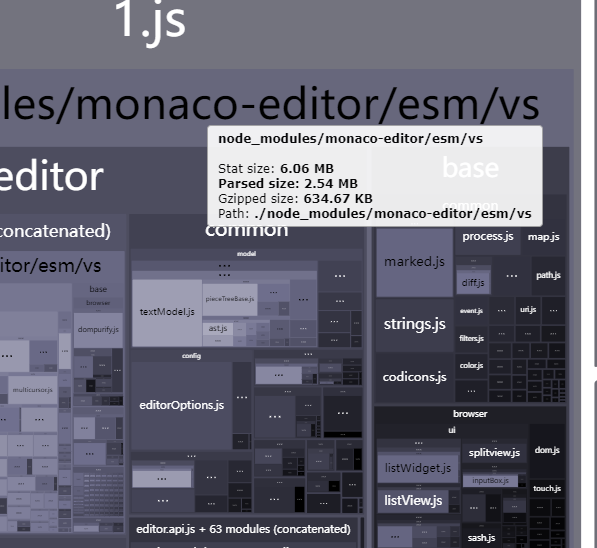
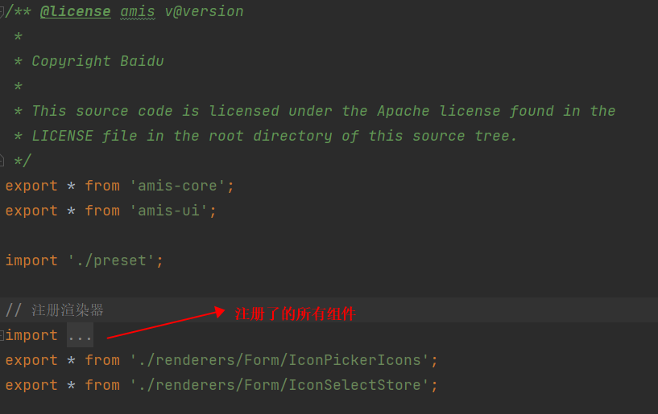

# amis 打包大分析
## 前言
amis 是一个前端页面生成器，通过配置JSON的方式生成页面。当我们引入amis在实际项目中使用时，发现了一些问题。
## 1. 打包体积过大
经过`ANALYZE=1`分析，发现amis打包体积过大，就光`monaco-editor`就有6M（gzip后2.54m)。


### 1.1 项目分析
项目内用到Amis的地方并不多，都是一些基础的增删改查页面，开发人员用amis配置写比较快。引入低代码的缘由是想提高开发效率，后面我们在实际跑了几个需求后，
得到的结论是：**amis并没有显著的提高开发效率，反而增加了打包体积和时间，增加了学习成本，增加了维护成本**。

由于项目中还有很多其他页面，我们并不能将amis页面的项目单独独立，因为某些组件是其它页面中的一个子tab或者依赖项。
项目中我们使用到最多的就是amis的crud，form这些，我们可以尝试将一些没用到的组件去掉。

### 1.2 amis源码分析
amis功能是被划分成多个子包实现，分别是amis-core、amis-ui、amis-editor等等。

官方建议的引入方式是：
```javascript
import { render } from 'amis';
```
这样的引入会有个问题，我们看`packages/amis/src/index.tsx`的源码，

它会默认将所有的组件都注册上，组件从`amis-ui`中获取，所以我们引入`amis`就会将`amis-ui`中的所有组件都打包进来。

### 1.3 它为什么要这样设计
amis的初衷就是使用JSON配置的方式生成页面，所以它的组件是动态的。
就是说没有JSON的情况下，它不知道需要用到哪些组件，所以它只能将所有组件都准备好，将所有组件都先组件注册上。

那么其实像amis这种框架，更适合与单独的项目，不适合与其它大型项目混合使用。

## 2. 打包时间过长&热更新慢
分析完amis的源码，我们试着找一些解决方案。
### 2.1 按需引入
按需引入基本不可能实现，原因上面也说了，如果你的JSON是后台接口返回的，实际内容打包的时候不知道，那么哪些组件需要引入这个在打包过程中是不确定的。

tree-shaking也是一样的道理，它也是需要在编译阶段(AST中分析)知道哪些组件需要引入，才可以知道那些组件未使用到能剔除。

### 2.2 手动剔除
简单分析了下amis-ui这个库，我发现它最大的体积并不是它本身而是`monaco-editor`和`froala-editor`。一个是`Editor`组件引入、一个是`RichText`组件引入。
我们可以手动剔除这两个依赖库，因为我知道我们项目中永远不会用到这两个组件。
```javascript
// webpack.config.js
export default {
  // 为防止将某些 import 的包(package)打包到 bundle 中，而是在运行时(runtime)再去从外部获取这些扩展依赖(external dependencies)。
  externals: {
    'monaco-editor': 'monaco-editor',
    'froala-editor': 'froala-editor'
  }
}
```
使用这个方法操作下来，虽然有效果，但并未达到预期的效果，打包体积还是大，时间还是长。

### 2.3 使用插件剔除
大概思路是编写一个webpack插件，将`amis-ui`中的`Editor`引入都剔除掉，这样就不会打包进来了。

可是我最终都没有实现这个插件，因为我发现我编写的插件都是有bug的会导致打包失败，而且我也没有太多时间花在这个上面。

### 2.4 最终解决方案
最后的解决方案是：将amis的页面全部剔除掉，能迁移的迁移到另一个纯amis项目，不能迁移的使用传统React重写。

## 3. amis源码的建议
更多的是对于打包体积过大的问题

### 声明式引入
我觉得amis可以提供声明式引入和全量引入两种方式。一种是把用到的组件让开发自行的去引入，这样虽然开发的成本会增加，
但是开发者可以对自己的项目进行优化，比如某些场景下完全可以判定`Editor`组件不会用到，那么就可以不声明引入。

### 插件化
amis的组件都是放在amis-ui中的，导致amis-ui的体积过大，并且如果想自己发布一个自己的组件，也需要将组件放在amis-ui中。
为什么不放在项目中，使用amis提供的自定义组件实践？那如果我有多个项目需要同时用到呢？甚至我觉得这个是很好的组件想分享给开源社区呢？

插件化可以很好的解决这类问题，现在的框架都会提供插件化的方案，比如vue、react、webpack等等。这样能很好的增加扩展和解耦。

amis完全可以将CRUD相关的组件作为基础组件放到基础组件库中，将`Editor`组件，当做一个插件，放到插件库中。

## 总结
amis是一个很好的低代码框架，但是它的设计初衷是为了单独的项目，不适合与其它项目混合使用。
如果在现有项目中使用，会显著增加打包体积和时间，最好的方式是将amis单独拆分出来，作为一个独立的项目。
如果amis想支持在现有项目中直接引入，需要其提供声明式引入和插件化的解决方案，否则不建议。
