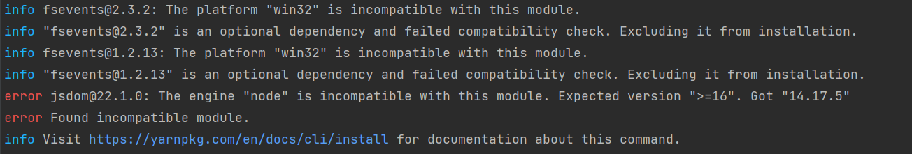
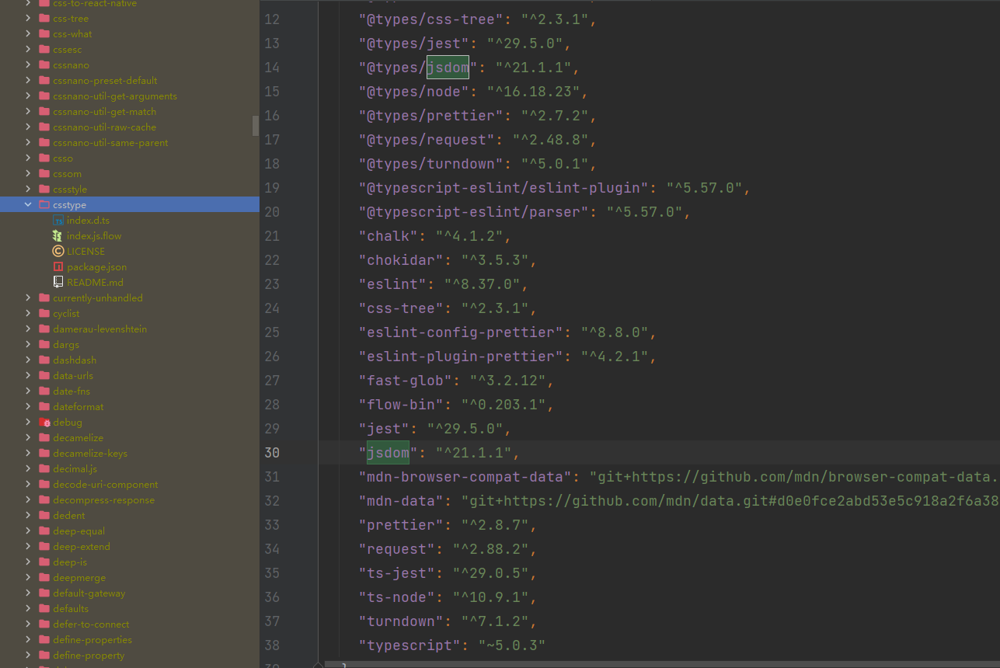
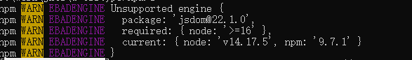

# 谈yarn和node版本

## 前言
最近在打包一个老项目时，居然报错了，看到报错信息，这令我不可思议

可以看到报错信息是项目中依赖了`jsdom@22.1.0`，最低支持node 16以上的版本，使用14.17.5这个版本安装所以报错了。

## ~~1. 追究问题来源（错误分析）~~
~~我明确知道自己没有添加任何依赖，也没有修改任何依赖，为什么会出现这个问题呢？
经过我的分析我发现，依赖关系如下：~~
```
-- umi-plugin-react: ^1.4.0
    -- antd-mobile: 2.x
        -- rc-swipeout: ~2.0.0
            -- @types/react: latest
                -- csstype: ^3.0.2
                    -- jsdom: ^21.1.1
```
~~我们可以看到`rc-swipeout`库引入了`@types/react`库，并且它是引用最新版本的`@types/react`库。
这看起来没什么问题，引入`react`最新的类型，看起来并没有什么问题。然而`@types/react`库依赖`csstype`库，这个库就是提供css的类型聚合。
然而`csstype: ^3.0.2`这个库的引入却有一大堆的依赖项，一个单纯提供css类型的库居然有这么多依赖项？~~


## ~~2. csstype库分析（错误分析）~~
~~看看`csstype`是怎么拿到类型的，为什么会需要这么多依赖项呢？~~
> ~~https://github.com/frenic/csstype~~

~~我们可以看到`csstype`库它其实是一个自动维护的库，什么意思呢？就是它会自动从`MDN`上抓取最新的css类型，然后生成对应的类型文件。
也就是说这两个类型文件是通过代码生成的，不是手动维护的。它为了解析`MDN`上的HTML，它引入了`jsdom`库，解析对应的HTML，然后分析再生成对应的类型文件。~~

~~它的拉取和分析的过程会用到非常多的依赖。然而我觉得它并不能将这些依赖都上传到npm上，因为这些依赖并不是它的核心功能，它的核心功能是生成类型文件。
其实它的package.json只需要`"types": "index.d.ts",`就够了。~~

### 3. 复现问题
上述2步分析思路没有错，但是呢。`csstype`库中的`jsdom`引入是放在`devDependencies`中的，实际不会去校验和安装这个npm库。

**什么时候会发生包版本和node版本校验不通过呢？** 这让我无法好奇，我继续往下探究，先从npm如何管理包开始。

最终追踪结果：
```
-- umi-build-dev: ^1.18.9
    -- af-webpack: 1.14.9
        -- @svgr/core: 3.1.0
            -- h2x-core: ^1.1.1
                -- h2x-parse: ^1.1.1
                    -- jsdom: >=11.0.0
```
最终是`h2x-parse`引入的`jsdom`库需要设定的版本需要大于 11.0.0 版本。
#### 3.1 问题原因
`h2x-parse`引入的`jsdom`库需要设定的版本需要大于 11.0.0 版本，导致在安装时选择了当前最后的一个LTS版本22.1.0。在这个版本开发者升级了一些功能，
导致其限制了node版本为16.0.0以上，应该是使用了node版本的一些新特性。

这个问题就有点意思了，所以为什么会有些老的版本安装不上，开源社区贡献的代码大部分都不会强制锁版本，正常只会锁到y（x.y.z)。其实还是有风险的，
我建议开发者都应该锁版本，推送z版本的更改必须要求是兼容的。这样应该会让所有开发者收益。

#### 3.2 解决方案
1. 使用`yarn install --ignore-engines`安装
2. 使用`npm i`安装


npm 只会给警告，比较友好。

### 总结
上面说明了node版本和包版本的问题，遇到该问题需要通过报错信息找到触发的依赖项，并提供两种简单的解决方案。
要想完全避免这个问题，建议开源开发者锁版本（根源还是npm包管理设计的有缺陷）。

*ps: 后续我会深入的写一下`npm`的包管理设计缺陷和那糟糕`node_modules`文件夹。*


